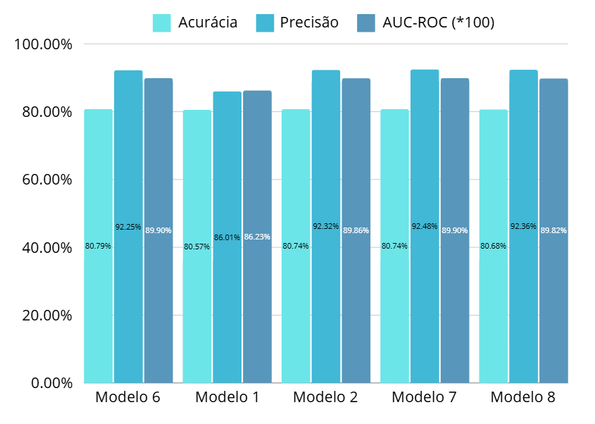
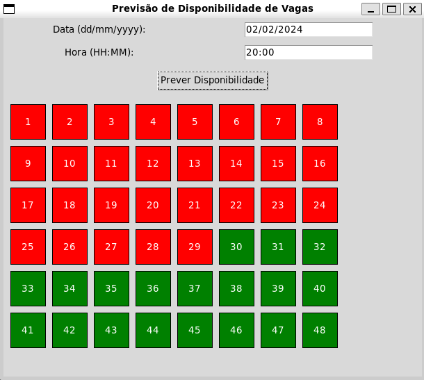

# Parkify-AI

Monitoramento e Gerenciamento Inteligente de Vagas em Tempo Real.

## Sumário

- [Introdução](#introdução)
- [Objetivos do Projeto](#objetivos-do-projeto)
- [Estrutura dos Dados](#estrutura-dos-dados)
- [Algoritmo de Geração de Dados Sintéticos](#algoritmo-de-geração-de-dados-sintéticos)
- [Arquitetura da Rede Neural](#arquitetura-da-rede-neural)
  - [Modelo Escolhido](#modelo-escolhido)
  - [Conceitos de Overfitting e Underfitting](#conceitos-de-overfitting-e-underfitting)
  - [Funções de Ativação Utilizadas](#funções-de-ativação-utilizadas)
- [Avaliação do Modelo](#avaliação-do-modelo)
  - [Métricas de Desempenho](#métricas-de-desempenho)
  - [Matriz de Confusão](#matriz-de-confusão)
  - [Cálculo de Acurácia e Precisão](#cálculo-de-acurácia-e-precisão)
- [Justificativa da Escolha do Modelo 6](#justificativa-da-escolha-do-modelo-6)

## Introdução

O **Parkify-AI** é um projeto que visa aprimorar o monitoramento e gerenciamento de vagas de estacionamento em tempo real, utilizando técnicas de Inteligência Artificial para prever a disponibilidade de vagas e fornecer notificações aos motoristas.

## Objetivos do Projeto

- **Predição de Disponibilidade**: Analisar padrões para prever quais vagas estarão disponíveis em determinados horários, com base no histórico de ocupação.

<br>

- **Aprendizado Contínuo**: Melhorar o desempenho com dados acumulados para tornar as recomendações mais precisas ao longo do tempo.

## Estrutura dos Dados


<div align="center">


Os dados utilizados no projeto possuem a seguinte estrutura:

| Coluna         | Descrição                                                                             |
|----------------|---------------------------------------------------------------------------------------|
| **Vaga**       | Identificação única da vaga (ex.: A1, B5).                                            |
| **Status**     | Indica se a vaga está ocupada (0) ou livre (1).                                       |
| **Data**       | Dia em que a vaga foi monitorada (formato DD/MM/AAAA).                                |
| **Day of Week**| Dia da semana (0 = Segunda-feira, 6 = Domingo).                                       |
| **Time (min)** | Tempo em minutos desde o início do dia.                                               |
| **Is Weekend** | Indica se é fim de semana (0 = Não, 1 = Sim).                                         |


</div>


### Exemplo de Dados Processados


<div align="center">


| Vaga | Status | Data       | Day of Week | Time (min) | Is Weekend |
|------|--------|------------|-------------|------------|------------|
| A1   | 0      | 16/08/2024 | 4           | 387        | 0          |
| A1   | 1      | 16/08/2024 | 4           | 720        | 0          |


</div>


## Algoritmo de Geração de Dados Sintéticos

O repositório contém um algoritmo em Python para gerar dados simulados de ocupação e disponibilidade de vagas. Este algoritmo é essencial para treinar e validar os modelos de IA que realizam as predições e notificações.

- **Expansão Granular**: Gera registros em intervalos de 5 minutos para uma análise mais detalhada dos padrões de ocupação.
- **Enriquecimento de Dados**: Adiciona variáveis derivadas, como períodos do dia e indicadores de fim de semana, para melhorar a qualidade do modelo.

## Arquitetura da Rede Neural

O projeto utiliza uma rede neural para realizar as predições de disponibilidade de vagas. Vários modelos foram testados, e o **Modelo 6** foi escolhido como o mais adequado.

### Funções de Ativação Utilizadas:

**ReLU:**

- Aplicada nas camadas intermediárias.
- Filtra valores negativos, mantendo apenas os valores positivos, ajudando o modelo a aprender relações complexas e aumentando a eficiência do treinamento.

<br>

```math
f(x) = 
\begin{cases} 
x & \text{se } x > 0 \\
0 & \text{se } x \leq 0
\end{cases}
```

<br>

#### Por que a ReLU é Importante no Treinamento ? 

- **Evita Neurônios Mortos**  
  - Sem a ReLU, camadas ocultas poderiam acumular muitos valores negativos ou insignificantes.  
  - A ReLU zera esses valores, "ligando" apenas neurônios relevantes.

<br>

#### Exemplo Prático no Parkify-AI

Suponha que o modelo receba como entrada:
- **Dia da semana**: 6 (sábado).
- **Horário transformado**: Time(sin) = -0.5.
- **Indicador de final de semana**: Is Weekend = 1.

Após os pesos e bias serem aplicados em uma camada densa, um dos neurônios pode produzir:
- **Entrada Neuronal (pré-ativação)**: \( x = -3 \).

A função ReLU, ao ser aplicada:
```math
f(x) = \max(0, -3) = 0
```

<br>

Portanto, nesse caso pode-se dizer que a ativação foi zerada e o neuronio 'descartado'.

**Sigmoid:**

- Aplicada na última camada.
- Converte a saída do modelo em uma probabilidade, facilitando a interpretação para classificação binária (como "ocupado" ou "disponível").

```math
  f(x) = \frac{1}{1 + e^{-x}}
```
#### Exemplo Prático:

- Supondo um modelo que cálcula a probabilidade de chover com base em condições climáticas:
  - E que seu x = 2

Teriamos o seguinte cálculo na função sigmoid:

```math
  f(2) = \frac{1}{1 + e^{-2}} \approx 0.88
```

<br>

Ou seja, nesse caso, a probabilidade de chover na data prevista seria de 88%.


### Conceitos de Overfitting e Underfitting

- **Overfitting**: Ocorre quando o modelo se ajusta tão bem aos dados de treinamento que não generaliza bem para novos dados. O modelo "decora" os dados de treinamento, perdendo a capacidade de fazer predições precisas em dados desconhecidos.

- **Underfitting**: Acontece quando o modelo é muito simples e não consegue capturar padrões nos dados. Ele não consegue nem mesmo representar bem os dados de treinamento, resultando em baixa performance tanto em treinamento quanto em teste.

### Relação entre Hiperparâmetros e Overfitting/Underfitting

Ao ajustar os hiperparâmetros de uma rede neural, é fundamental equilibrar a complexidade do modelo e o comportamento do aprendizado. No caso do Parkify-AI, os seguintes pontos foram considerados:

1. **Taxa de Aprendizado**:
   - **Menor taxa de aprendizado**: A rede neural aprende mais devagar, analisando detalhadamente cada padrão. No entanto, isso pode levar ao **overfitting**, pois o modelo pode acabar memorizando os dados de treinamento.

   <br>

   - **Maior taxa de aprendizado**: A rede neural aprende mais rapidamente, mas corre o risco de não captar padrões complexos, resultando em **underfitting**.

   <br>


2. **Número de Camadas e Neurônios**:
   - **Mais camadas/neurônios**: Aumentam a capacidade da rede de captar padrões complexos. Contudo, redes muito profundas podem sofrer de **overfitting**, ajustando-se excessivamente aos dados de treinamento.

   <br>

   - **Menos camadas/neurônios**: Simplificam o modelo, reduzindo o risco de overfitting. No entanto, podem levar ao **underfitting** se não forem capazes de modelar a complexidade dos dados.
   
   <br>

## Avaliação do Modelo

### Métricas de Desempenho

- **Acurácia**: Proporção de todas as previsões corretas do modelo.
- **Precisão**: Proporção de predições corretas em relação às predições positivas feitas pelo modelo.
- **Recall (Sensibilidade)**: Proporção de positivos reais que foram corretamente identificados pelo modelo.
- **AUC-ROC**: Métrica que avalia a capacidade do modelo em distinguir entre as classes positivas e negativas.

### Matriz de Confusão

A matriz de confusão para o Modelo 6 é apresentada a seguir:


<div align="center">


| Predito |     0     |     1     |   Total   |
|---------|-----------|-----------|-----------|
| **Real 0**   | 201,922 |  29,384 | 231,306  |
| **Real 1**   | 101,807 | 349,687 | 451,494  |
| **Total**    | 303,729 | 379,071 | 682,800  |


</div>


Imagine que estamos tentando identificar se uma vaga de estacionamento está ocupada (1) ou livre (0).

- **Verdadeiro Positivo (TP)**: O modelo previu que a vaga está ocupada, e ela realmente está ocupada.
- **Falso Positivo (FP)**: O modelo previu que a vaga está ocupada, mas ela está livre.
- **Falso Negativo (FN)**: O modelo previu que a vaga está livre, mas ela está ocupada.
- **Verdadeiro Negativo (TN)**: O modelo previu que a vaga está livre, e ela realmente está livre.

### Interpretação da Matriz de Confusão

- **Verdadeiros Negativos (TN)**: 201,922
  - O modelo previu 0 e o valor real também era 0.
- **Falsos Positivos (FP)**: 29,384
  - O modelo previu 1, mas o valor real era 0.
- **Falsos Negativos (FN)**: 101,807
  - O modelo previu 0, mas o valor real era 1.
- **Verdadeiros Positivos (TP)**: 349,687
  - O modelo previu 1 e o valor real também era 1.

### Diferença entre Acurácia e Precisão

- **Acurácia**: É a proporção de todas as previsões corretas do modelo. No contexto, 80.79% das vezes o modelo acertou se a vaga estava ocupada ou não.

<br>

- **Precisão**: Avalia a qualidade das predições positivas. Dos casos em que o modelo previu que a vaga estava ocupada, 92.25% estavam realmente ocupadas.

### Cálculo de Acurácia e Precisão
<br>


- **Acurácia**:

  $$
  \text{Acurácia} = \frac{TP + TN}{TP + TN + FP + FN} = \frac{349,687 + 201,922}{682,800} \approx 80.79\%
  $$


<br>


- **Precisão**:

```math
  \text{Precisão} = \frac{TP}{TP + FP} = \frac{349,687}{349,687 + 29,384} \approx 92.25\%
```


### AUC-ROC

- **ROC (Receiver Operating Characteristic)**: Curva que representa a taxa de verdadeiros positivos (sensibilidade) contra a taxa de falsos positivos (1 - especificidade).
- **AUC (Area Under the Curve)**: Mede a capacidade do modelo em distinguir entre as classes. Varia de 0.5 (chute aleatório) a 1.0 (modelo perfeito).
- **Interpretação do AUC-ROC de 0.8990**: O modelo tem 89.90% de chance de distinguir corretamente entre uma vaga ocupada e uma vaga livre.

### Modelo Escolhido

- **Estrutura da Rede**:
  - **Camada 1**: 64 neurônios
  - **Camada 2**: 32 neurônios
  - **Camada 3**: 16 neurônios
- **Taxa de Aprendizado**: 0.001
- **Função de Ativação**: ReLU nas camadas ocultas e Sigmoid na saída
- **Épocas de Treinamento**: 15

#### Desempenho do Modelo 6

- **Perda de Validação**: 0.39
- **Acurácia no Conjunto de Teste**: 80.79%
- **Precisão no Conjunto de Teste**: 92.25%
- **AUC-ROC**: 0.8990

## Justificativa da Escolha do Modelo 6

<div align="center">



</div>

- **Equilíbrio entre Complexidade e Desempenho**:
  - Modelos mais complexos, como o Modelo 12 (512, 256, 128 neurônios), apresentaram um ganho na acurácia, mas com maior risco de overfitting.
- **Taxa de Aprendizado Adequada**:
  - Uma taxa de aprendizado de 0.001 permite que o modelo aprenda de forma estável, reduzindo os riscos de overfitting e underfitting.
- **Desempenho Geral**:
  - O Modelo 6 alcançou uma acurácia de 80.79% e uma precisão de 92.25%, com um AUC-ROC de 0.8990, indicando excelente capacidade de generalização.
- **Menor Risco de Overfitting**:
  - Com menos neurônios e camadas, o modelo é menos propenso a se ajustar excessivamente aos dados de treinamento.

### Resultados e UI

O **Parkify-AI** é capaz de identificar com alta precisão o status das vagas de estacionamento, fornecendo informações confiáveis sobre a disponibilidade das vagas. Para testes e validação do modelo, foi desenvolvida uma interface de usuário (UI) simples e funcional, que permite explorar as capacidades do sistema de forma interativa.

A seguir, descrevemos os principais elementos e funcionalidades dessa UI de teste:

1. **Campo de Data**:
   - **Descrição**: Permite que o usuário insira a data no formato `DD/MM/AAAA`.
   - **Exemplo**: `02/02/2024`.

2. **Campo de Hora**:
   - **Descrição**: Permite que o usuário insira o horário no formato `HH:MM`.
   - **Exemplo**: `20:00`.

3. **Botão "Prever Disponibilidade"**:
   - **Descrição**: Após preencher os campos de data e hora, o usuário deve clicar neste botão para gerar a previsão de disponibilidade de vagas.

4. **Mapa de Vagas**:
   - **Descrição**: Representa graficamente as vagas disponíveis e ocupadas no estacionamento.
   - **Cores**:
     - **Vermelho**: Vagas ocupadas.
     - **Verde**: Vagas disponíveis.
   - **Exemplo na Imagem abaixo**:
     - As vagas de 1 a 29 estão ocupadas (em vermelho).
     - As vagas de 30 a 48 estão livres (em verde).


<div align="center">





</div>


### Como Funciona

1. O usuário insere a **data** e o **horário** desejados.

<br>

2. Ao clicar no botão "Prever Disponibilidade", o sistema consulta o modelo de IA para calcular quais vagas estarão disponíveis no momento especificado.

<br>

3. A previsão é exibida diretamente no mapa de vagas, facilitando a visualização para o usuário.
